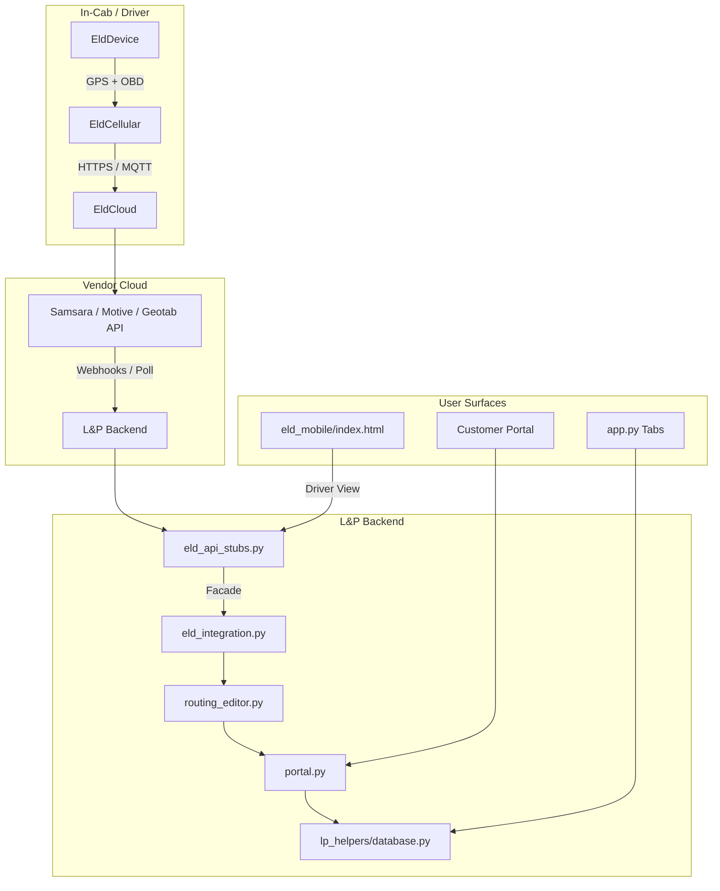

# L & P Freight — Hardware / ELD Integration Roadmap

## Architecture



## Phase 1 — Stub + Data Model (NOW)

- [x] `eld_integration.py` — `ELDClient` facade with `StubEldProvider`
- [x] `eld_api_stubs.py` — `SamsaraProvider`, `MotiveProvider`, `GeotabProvider` (raise `NotImplementedError` until credentials)
- [x] `eld_mobile/index.html` — driver-cab web view (speed, ETA, HOS, current BOL)
- [x] `ingest_eld_miles(load_id, actual_loaded, actual_empty)` — bridges ELD → `routes` table
- [x] `create_eld_webhook(payload)` — webhook ingress stub

## Phase 2 — Live Integration (NEXT)

1. **Choose vendor** (Samsara recommended for small fleets; Motive strongest driver-app UX)
2. Provision API token + install vehicle gateway / dash cam
3. Implement `SamsaraProvider` methods against real REST endpoints
4. Add webhook route (`POST /webhooks/eld`) in deployment config (Cloudflare tunnel / Flask wrapper)
5. Replace `StubEldProvider` with live provider in `ELDClient`

### Priority code tasks
- [ ] Stand up minimal FastAPI / Flask endpoint for webhooks
- [ ] Add `requests` / `httpx` to `requirements.txt`
- [ ] Implement `SamsaraProvider.get_vehicle_location` polling + cache TTL
- [ ] Implement `MotiveProvider.push_dispatch` for in-cab BOL delivery
- [ ] Map HOS `DriverHos` fields to Samsara/Motive duty-status schema
- [ ] Add webhook signature verification (`X-Samsara-Signature` / Motive HMAC)

## Phase 3 — Driver App

- [ ] Convert `eld_mobile/index.html` to PWA (service worker + offline cache)
- [ ] Add React Native or Flutter wrapper if native app is required
- [ ] Push dispatch via `ELDClient.push_dispatch` from **Billing & Driver Pay** tab
- [ ] BOL acceptance flow → `ELDClient.ack_bill_of_lading` → webhook → `settlements`
- [ ] HOS alerts when `drive_remaining_hours < 2.0`

## Phase 4 — Automation + Analytics

- [ ] Auto-create `routes` row from ELD GPS breadcrumbs when load is dispatched
- [ ] Compare ELD actual miles vs Google planned miles → auto-flag variance
- [ ] Route replay in Customer Portal (`routes.waypoints` + timestamped locations)
- [ ] IFTA auto-population from ELD state-mile data

## DB extensions

```sql
CREATE TABLE IF NOT EXISTS eld_events (
    id INTEGER PRIMARY KEY AUTOINCREMENT,
    event_type TEXT,
    payload TEXT,
    logged_at TEXT DEFAULT (datetime('now'))
);

ALTER TABLE loads ADD COLUMN eld_device_id TEXT;
ALTER TABLE loads ADD COLUMN eld_last_location TEXT;
```

## API Reference (stub shapes)

```python
# Vendor agnostic calls
ELDClient().get_vehicle_location("TRUCK-1")   # -> VehicleLocation
ELDClient().get_driver_hos("driver-1")         # -> DriverHos
ELDClient().push_dispatch("driver-1", load)    # -> {status, bol_number}
ELDClient().ack_bill_of_lading("driver-1", bol) # -> {status, accepted_at}

# Webhook ingress
create_eld_webhook({
    "provider": "samsara",
    "event": "location_update",
    "vehicle_id": "TRUCK-1",
    "driver_id": "driver-1",
    "load_id": 1,
    "data": {"lat": 35.9, "lon": -82.0, "speed": 55}
})
```

## Next code tasks (prioritized)

1. Add `FastAPI` webhook receiver (`webhooks/eld.py`)
2. Implement `SamsaraProvider` against sandbox
3. Add ELD card to `app.py` Driver tab or add tab
4. Wire `ingest_eld_miles` into settlement creation flow
5. HOS alert banner in driver mobile view
